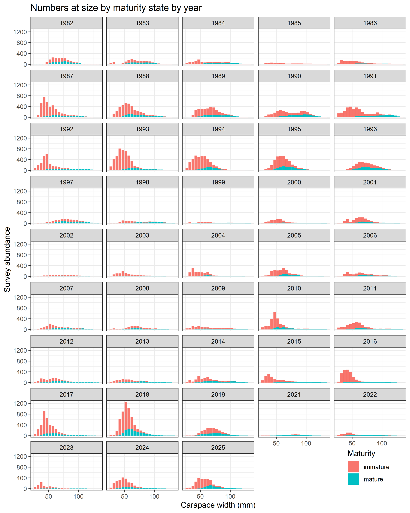
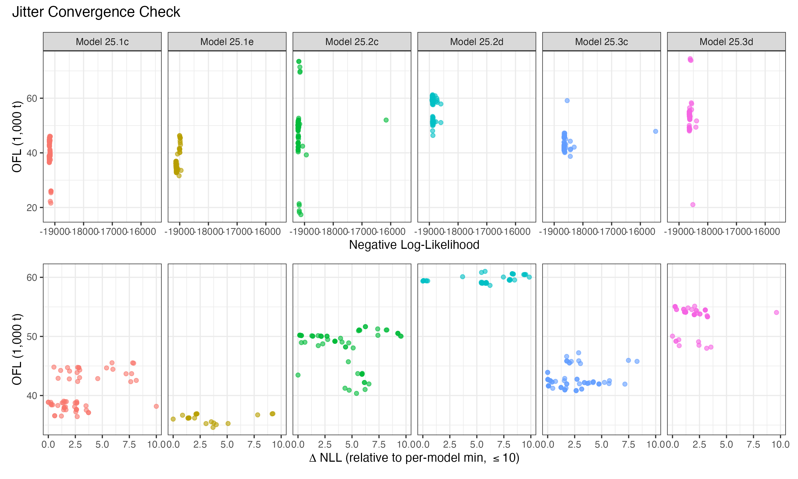
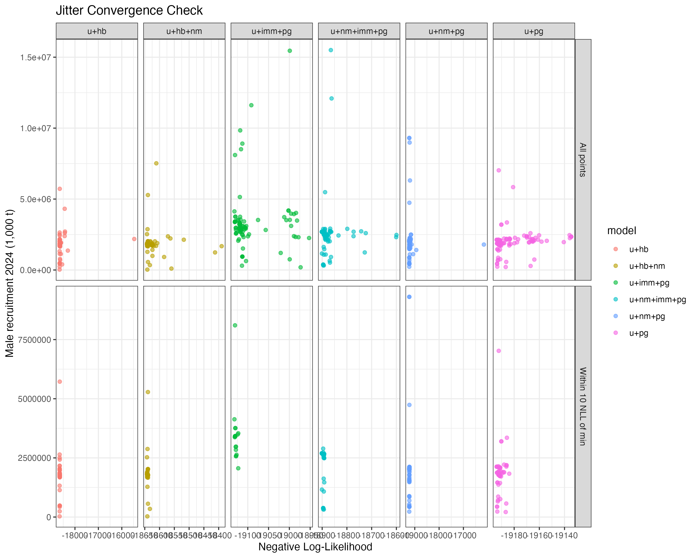
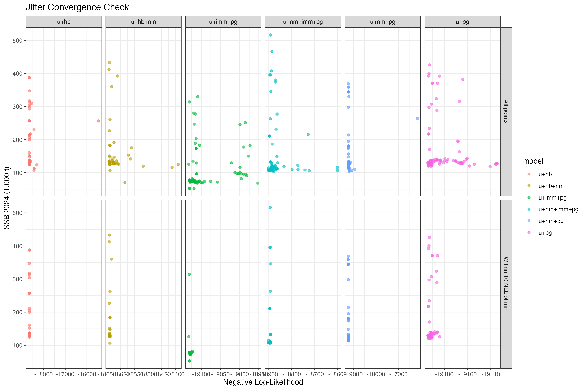
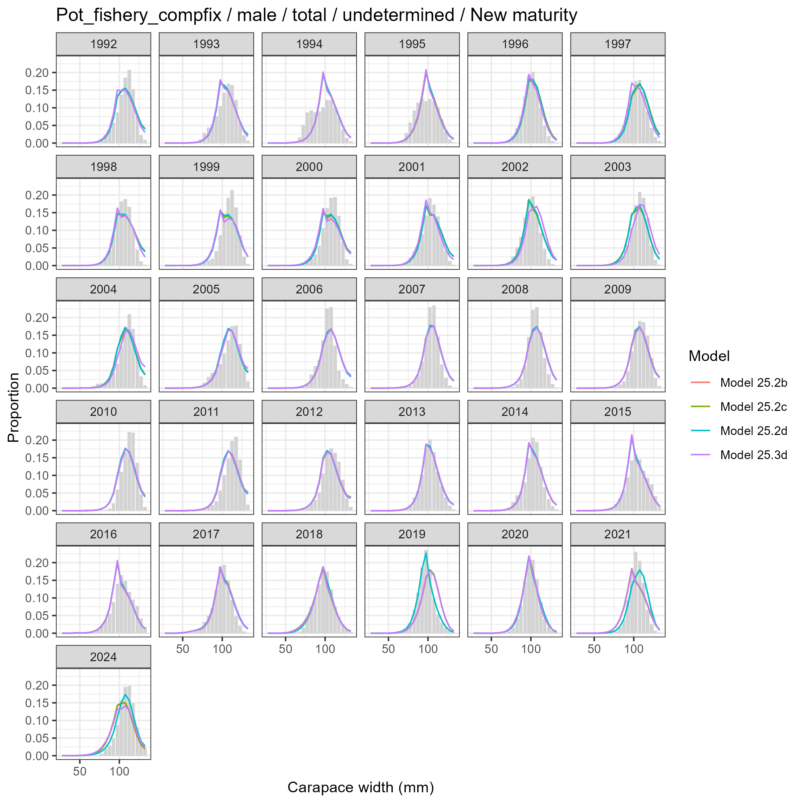
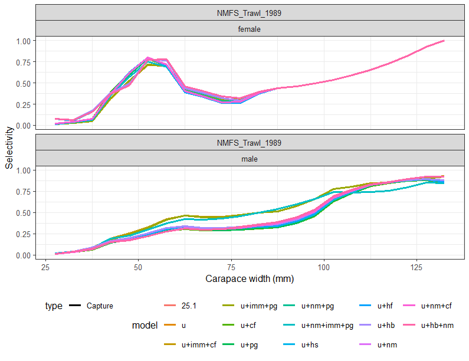

```{r setup, include=FALSE}
# Packages used by the data-comparison chunks below.
suppressPackageStartupMessages({
  library(dplyr)
  library(ggplot2)
  library(tidyr)
  library(stringr)
  library(purrr)
  library(wtsGMACS)
  library(wtsUtilities)
})

# Load model results list and the model_defs / model_shorts / to_short() helpers
reslst <- wtsUtilities::getObj("Models/rda_ModelsResLst.RData")
source("0-models.R")

# Cases used by the maturity ogive comparison (legacy vs new workflow)
case_for_mat_plot <- c(
  "25.1 gmacs (update + compfix + plus group)",
  "25.1 gmacs (update + compfix + plus group + new_mat)"
)

# Compact theme for slide-friendly figures
theme_slide <- function(base_size = 9) {
  theme_bw(base_size = base_size) +
    theme(
      legend.position  = "bottom",
      legend.text      = element_text(size = base_size - 1),
      legend.title     = element_text(size = base_size - 1),
      strip.background = element_rect(fill = "white"),
      strip.text       = element_text(size = base_size - 1),
      panel.spacing    = unit(0.6, "lines"),
      plot.caption     = element_text(size = base_size - 2, colour = "grey30")
    )
}

# Long-label -> short scenario tag for the data-comparison plots
data_scenarios <- c(
  "25.1 gmacs (update + compfix)"                                          = "compfix",
  "25.1 gmacs (update + compfix + plus group)"                             = "+plus group",
  "25.1 gmacs (update + compfix + imm_surv)"                               = "+imm_surv",
  "25.1 gmacs (update + compfix + plus group + imm_surv)"                  = "+plus group + imm_surv",
  "25.1 gmacs (update + compfix + new_mat)"                                = "+new_mat",
  "25.1 gmacs (update + compfix + plus group + new_mat)"                   = "+plus group + new_mat",
  "25.1 gmacs (update + compfix + plus group + hyb_fishery)"               = "+hyb_fishery",
  "25.1 gmacs (update + compfix + plus group + hyb_surv)"                  = "+hyb_surv",
  "25.1 gmacs (update + compfix + plus group + hyb_both)"                  = "+hyb_both",
  "25.1 gmacs (update + compfix + plus group + hyb_both + new_mat)"        = "+hyb_both + new_mat"
)
```

# Context and SSC/CPT requests

## EBS snow crab context

::: {.columns}
::: {.column width="55%"}

- No federal OFL/ABC has ever constrained removals.

- Despite conservative management relative to OFL, the stock remains at historical lows.

- Commercially preferred males (>=101 mm CW) at all-time lows.

- 2025 survey commercially preferred male biomass: **23.28 kt** (for reference, candidate Tier 3 OFLs span 36--60 kt).

- Stock declared overfished in 2021; rebuilding update will be added to the September SAFE.

:::
::: {.column width="45%"}


**Currency of management**

"MMB":

- OFL will not be constraining
- Allows removal of all large males


:::
:::

## Purpose of this preliminary cycle

This document presents **model explorations** requested by the SSC and CPT and seeks guidance on which models to advance to the **September 2026** final assessment.


Three axes of uncertainty were evaluated:

1. **Data processing updates** -- corrected total-male composition, enlarged plus group, and immature survey index inclusion.
2. **Updated maturity** developed by the Kodiak lab (Ryznar, in prep).
3. **Inclusion of hybrids** (snow $\times$ Tanner) in survey and/or fishery data.


**14 models** are presented; **no author-preferred model** is recommended at this time.

## SSC comment: hybrids

*2025(10) SSC. As with a similar SSC recommendation for Tanner crab, the SSC recommends consideration of different inclusions/exclusions of hybrids into the snow crab assessment (i.e., in survey and catch data) to evaluate sensitivity to these options and ensure an internally consistent approach.*


**Response.** We evaluated inclusion of hybrids in the survey and fishery time series independently and jointly (`Models 25.3a--25.3d`).


- Effect on management advice was **modest**.
- Recommend **excluding hybrids from further assessments** because they are avoided by the directed fishery.
- Retained catch already contains hybrids that cannot be separated from snow crab; recommend a smaller buffer on OFL to account for this.

## SSC comment: jittering and likelihood profiles

*2025(10) SSC. The SSC recommends the use of likelihood profiles to describe uncertainty and uses jittering analyses only to ensure that the results provided come from the model with the lowest negative log likelihood.*


- We ran **100-jitter** runs across six models across scenarios.
- **Likelihood profiles will be included in September 2026.**


*2024(10) SSC. The SSC requested investigation of the bimodality observed in the 2024 jitter analysis (two clouds of OFLs differing by ~5,000 t).*

The bimodality persists in most 2026 candidates **except** when the immature survey index is included alongside the updated plus group (`Model 25.1e`, `Model 25.2d`). **However**, this leads to high estimates of mature male M (>0.6).

## SSC comment: maturity ogive

*2024(10) SSC. The SSC again requests an analysis of the probability of maturing/terminal molt which addresses the observation error in these data and the lack of a monotonically increasing curve...*


- **Kodiak lab presented an updated workflow** in January 2025; further refinements to be presented at this meeting.
- The new workflow uses an **`sdmTMB` spatiotemporal model** fit to chela-based maturity classifications.
- We present **two maturity ogive scenarios** (`Models 25.2`).
- Observation error is not yet propagated into the assessment -- this is an area of future improvement.

## SSC comment: morphometric maturity overlay (Fig. 9)

*2025(10) SSC. The SSC recommends that morphometric maturity status be overlaid on the size distribution plots to allow visual tracking of growth and the transition to maturity by cohort.*

Updated figure with new survey + new maturity workflow will be in the September document.

{height="4.9in"}


## Other SSC items addressed


- **Rebuilding analysis.** Will be added to the September SAFE.
- **Tier 4 fallback** (2024(10) SSC; 2024(6) CPT). Standardized Tier 4 fallback (REMA-smoothed total mature male biomass; $F$ = best $M$ estimate from Tier 3) **will be presented in September**. For reference, 2025 Tier 4 OFLs were 28.41, 8.64, and 6.11 kt for morphometric, large (>=95 mm), and preferred (>101 mm) males.
- **Maximin / yield-per-recruit** (2024(10), 2025(6) SSC). Maximin work was extended in Szuwalski and Punt (2025); steepness values 0.5/0.67/0.8 do not match available reproductive data. YPR exercise was not completed.
- **Density-dependent maturity / temperature--$M$ link** (2025(6) SSC). Both relationships described in Szuwalski et al. (2026).
- **Clutch fullness / reproductive contribution of small males** (2025(6) SSC). Preliminary analyses do not show an important link to recruitment; CamSled work observed small mature males grasping mature females.
- **VAST / NBS+EBS** (2024(10) SSC). Indices for mature females and large males presented to May 2025 CPT; cautious about extrapolating into NBS in years without data.

# Assessment scenarios

## Model framework

Same structural assumptions across all scenarios -- differences only in **GMACS version, data processing, maturity ogive, and hybrids**.


- Probability of terminal molt at size **input as data** (varies by year and size).
- Survey selectivity estimated by era (1982--88; 1989--present) and sex with priors from BSFRF.
- Growth = linear function of pre-molt CW with specified variance.
- Natural mortality estimated by sex/maturity with **mortality events** in 2018 and 2019.
- All immature crab molt; mature crab undergo terminal molt.
- Total and retained fishery selectivity = logistic curves.
- All non-directed bycatch lumped into a single fleet.
- Recruitment estimated separately for males and females; first 3 size bins.


GMACS **v2.20.34** (compiled 2026-01-15) for all candidate runs except rolled forward model (`Model 25`).

## Abbreviations --


| Suffix | Meaning |
|--------|---------|
| `update` | Updated GMACS executable (2.20.34) |
| `compfix` | Total-male comp file corrected |
| `plus group` | Plus group widened to include all crab > 135 mm CW |
| `imm_surv` | Immature survey biomass index added |
| `new_mat` | New `sdmTMB` maturity workflow (Kodiak; Ryznar in prep) |
| `hyb_fishery` | Hybrid catch added to directed-fishery comp / discards |
| `hyb_surv` | Hybrid added to NMFS summer trawl survey biomass / comp |
| `hyb_both` | Hybrids added to both survey and fishery |


 Models grouped under **four axes of uncertainty**.

## Axis 1 -- Model & composition data updates


| Model | Description |
|-------|-------------|
| `25`   | September 2025 author-recommended; rolled forward (no updates) |
| `25.1a` | `Model 25` fit with updated GMACS (2.20.34) |
| `25.1b` | `25.1a` + correct total-male composition file |
| `25.1c` | `25.1b` + plus group at >135 mm CW |

- Compfix reconciles a small file discrepancy from September 2025.
- Previously removed 278/2,239 (retained), total: 422/3,151 (total), and 1/1,175 (female discard) samples
- The **plus-group change makes the model run substantially faster** (23 min vs. 29 min) and is the **structural baseline** for most sensitivities.


::: {.columns}
::: {.column width="60%"}
### Total male composition fix

- Small discrepancy between discarded and males composition used in the September 2025 assessment and the version produced by the script that translates the ADF&G files.
- Re-ran the translation script and replacing the affected total-male composition entries.
- Effect on management quantities is small.

:::
::: {.column width="40%"}

```{r comp-compfix-update, fig.width=4.4, fig.height=4.6, out.width="100%"}
# Pot-fishery retained-male composition: update vs update + compfix
.years <- c(1992, 2011, 2014)
.df <- wtsGMACS::extractRep1Results(reslst, "Size_fit_summary") |>
  dplyr::mutate(across(c(year, size, aggObs), as.numeric)) |>
  dplyr::filter(
    case %in% c("25.1 gmacs (update)",
                "25.1 gmacs (update + compfix)"),
    fleet == "Pot_Fishery", comp_type == "total", sex == "male",
    year %in% .years
  ) |>
  dplyr::mutate(
    Scenario = dplyr::recode(case,
      "25.1 gmacs (update)"           = "update",
      "25.1 gmacs (update + compfix)" = "update + compfix")
  ) |>
  dplyr::distinct(Scenario, year, size, aggObs) %>%
  dplyr::arrange(year, size, Scenario)

ggplot(.df, aes(size, aggObs, colour = Scenario)) +
  geom_line(lwd = 0.6) + geom_point(size = 0.6) +
  facet_wrap(~year, ncol = 1) +
  labs(x = "CW (mm)", y = "Proportion", colour = NULL) +
  theme_slide(7)
```


:::
:::

### Plus group at >135 mm CW

::: {.columns}
::: {.column width="60%"}

- Previous model **ignored crab > 135 mm**.
- Updated plus group lumps all crab > 135 mm into a single bin for:
   - Retained males (n = 278 of 2,239 samples)
   - Total males (n = 422 of 3,151 samples)
   - Discard females (n = 1 of 1,175 samples)
- **Improves runtime substantially** (23 min vs. 29 min for the comparable model).
- Management quantities change very little.

:::
::: {.column width="40%"}

```{r comp-compfix-plusgroup, fig.width=4.4, fig.height=4.6, out.width="100%"}
# Pot-fishery retained-male composition: compfix vs +plus group (>135 mm)
.years <- c(2005, 2013, 2015)
.df <- wtsGMACS::extractRep1Results(reslst, "Size_fit_summary") |>
  dplyr::mutate(across(c(year, size, aggObs), as.numeric)) |>
  dplyr::filter(
    case %in% c("25.1 gmacs (update + compfix)",
                "25.1 gmacs (update + compfix + plus group)"),
    fleet == "Pot_Fishery", comp_type == "retained", sex == "male",
    year %in% .years
  ) |>
  dplyr::mutate(
    Scenario = dplyr::recode(case,
      "25.1 gmacs (update + compfix)"              = "no > 135",
      "25.1 gmacs (update + compfix + plus group)" = "+plus group")
  ) |>
  dplyr::distinct(Scenario, year, size, aggObs)

ggplot(.df, aes(size, aggObs, colour = Scenario)) +
  geom_line(lwd = 0.6) + geom_point(size = 0.6) +
  facet_wrap(~year, ncol = 1) +
  labs(x = "CW (mm)", y = "Proportion", colour = NULL,
       caption = "Plus group lumps crab > 135 mm into the terminal bin.") +
  theme_slide(7)
```

:::
:::


## Axis 2 -- Immature survey biomass index

| Model | Abr. | Description |
|-------|-------------|-------------|
| `25.1d` | update + compfix + imm_surv | `25.1b` + immature index |
| `25.1e` | update + plus group + imm_surv |`25.1c` + immature  index |


### NMFS immature survey biomass index

- Immature index provides **information on immature abundance**.
- **Removes the bimodality** observed in jitter analyses (see Results).
- Comes with a **substantially higher estimate of mature male $M$** (> 0.6) that propagates into reference points.
- Combination of immature index + hybrids was **not explored**.

```{r idx-imm, fig.width=11, fig.height=4.4, out.width="100%"}
# Immature index only enters the model when imm_surv is on; compare scenarios.
idx_imm <- wtsGMACS::extractRep1Results(reslst, "Index_fit_summary") |>
  dplyr::filter(
    case %in% c(
      "25.1 gmacs (update + compfix + plus group + imm_surv)",
      "25.1 gmacs (update + compfix + plus group + new_mat + imm_surv)"
    ),
    maturity == "immature"
  ) |>
  dplyr::mutate(
    across(c(year, obs, actual_CV), as.numeric),
    Scenario = dplyr::recode(case,
      "25.1 gmacs (update + compfix + plus group + imm_surv)"           = "imm_surv (old maturity)",
      "25.1 gmacs (update + compfix + plus group + new_mat + imm_surv)" = "imm_surv + new maturity"
    ),
    sd_log = sqrt(log(1 + actual_CV^2)),
    lba    = qlnorm(0.05, log(obs), sd_log),
    uba    = qlnorm(0.95, log(obs), sd_log),
    Sex    = stringr::str_to_title(sex)
  ) |>
  dplyr::distinct(Scenario, year, Sex, obs, lba, uba)

ggplot(idx_imm, aes(x = year, y = obs, colour = Scenario)) +
  geom_errorbar(aes(ymin = lba, ymax = uba), width = 0, linewidth = 1.5,
                position = position_dodge(width = 0.6), alpha = 0.45) +
  geom_point(size = 1.3, position = position_dodge(width = 0.6)) +
  facet_wrap(~Sex, scales = "free_y", ncol = 2) +
  scale_y_continuous(limits = c(0, NA), expand = expansion(mult = c(0, 0.08))) +
  labs(x = "Year", y = "NMFS immature survey biomass (1,000 t)",
       colour = NULL,
       caption = "Immature index introduces a new data source. New maturity workflow shifts crab between mature/immature classifications, so imm_surv data depends on which maturity workflow is used.") +
  theme_slide(8)
```


## Axis 3 -- New maturity workflow


| Model | Abr. | Description |
|-------|-------------|-------------|
| `25.2a` | update + new_mat | `25.1a` + new ogive |
| `25.2b` | update + compfix + new_mat | `25.1b` + new ogive |
| `25.2c` | update + compfix + plus_group + new_mat | `25.1c` + new ogive |
| `25.2d` | update + compfix + plus_group + new_mat + imm_surv | `25.1c` + new + immature survey |


- New workflow: **`sdmTMB` spatiotemporal model** fit to chela-based maturity classifications.
- Borrows information across years and locations; **does not extrapolate** beyond stations with measured crab.
- New workflow has a **much weaker temporal trend** in $\Pr$(terminal molt) at intermediate sizes than the legacy workflow.
- Updates affect mature male survey abundance and male composition data; female time series unchanged.

### New maturity workflow (Kodiak / Ryznar, in prep)


- Replaces the legacy "fit a curve to chela ratios per year/size" approach with a single **`sdmTMB` spatiotemporal model** fit to chela maturity classifications across all years and stations.
- Borrows information across years and locations for size bins with sparse chela data.
- Does not extrapolate the predicted spatial probability surface beyond stations with measured crab.
- Population-level annual ogive obtained by integrating the predicted surface across stations.
- **Result:** much weaker temporal trend in $\Pr$(terminal molt) at intermediate sizes.
   - Legacy: at 77 mm, ~0.2 (early 1990s) $\rightarrow$ ~0.5 (post-2010).
   - New: ~0.35--0.45 throughout the time series.
- Updated time series of mature male survey abundance and immature/mature comp data; female time series unchanged.
- Sample sizes and CVs of the dependent data **were not adjusted** -- a known limitation.


### Maturity ogive -- legacy vs. new workflow

```{r predmat-ogive, fig.width=11, fig.height=4.8, out.width="100%"}
# Existing predmat-style plot from SAFE_snow_gmacs.Rmd: probability of terminal
# molt vs. carapace width, coloured by year, faceted by maturity workflow.
mat_ogive <- case_for_mat_plot |>
  purrr::map_dfr(function(case_name) {
    dat <- reslst$outsLst[[case_name]]$mature_probability
    if (is.null(dat)) return(NULL)
    dat |>
      tidyr::pivot_longer(cols = -c(Sex, Year),
                          names_to = "width", values_to = "prob") |>
      dplyr::mutate(
        Maturity_Source = ifelse(grepl("new_mat", case_name, ignore.case = TRUE),
                                 "New maturity workflow",
                                 "Legacy maturity workflow"),
        width = as.numeric(as.character(width)),
        prob  = as.numeric(prob),
        Year  = as.numeric(Year)
      )
  }) |>
  dplyr::filter(Sex == "male")

ggplot(mat_ogive, aes(x = width, y = prob, colour = Year, group = Year)) +
  geom_line(lwd = 0.7, alpha = 0.7) +
  scale_y_continuous(limits = c(0, 1), expand = c(0, 0)) +
  scale_colour_viridis_c(option = "C") +
  facet_wrap(~Maturity_Source, ncol = 2) +
  labs(x = "Carapace width (mm)", y = "P(terminal molt)",
       colour = "Year",
       caption = "Legacy: strong increasing trend through time at intermediate sizes. New (sdmTMB): much weaker temporal trend.") +
  theme_slide(8)
```

### P(mature) over time -- 50, 80, 101 mm

```{r predmat-timeseries, fig.width=11, fig.height=4.6, out.width="100%"}
# Time series of probability of terminal molt for male crab at 50, 80, and
# 101 mm CW. The model size bins are 5-mm wide with midpoints 27.5, 32.5,
# ..., 132.5 mm; we pick the closest bin midpoints (47.5, 77.5, 102.5) and
# label them by their target size.
target_sizes <- c(`50 mm` = 47.5, `80 mm` = 77.5, `101 mm` = 102.5)

mat_ts <- case_for_mat_plot |>
  purrr::map_dfr(function(case_name) {
    dat <- reslst$outsLst[[case_name]]$mature_probability
    if (is.null(dat)) return(NULL)
    dat |>
      tidyr::pivot_longer(cols = -c(Sex, Year),
                          names_to = "width", values_to = "prob") |>
      dplyr::mutate(
        Maturity_Source = ifelse(grepl("new_mat", case_name, ignore.case = TRUE),
                                 "New maturity workflow",
                                 "Legacy maturity workflow"),
        width = as.numeric(as.character(width)),
        prob  = as.numeric(prob),
        Year  = as.numeric(Year)
      )
  }) |>
  dplyr::filter(Sex == "male", width %in% target_sizes) |>
  dplyr::mutate(
    Size = factor(names(target_sizes)[match(width, target_sizes)],
                  levels = c("50 mm", "80 mm", "101 mm"))
  )

ggplot(mat_ts, aes(x = Year, y = prob, colour = Maturity_Source)) +
  geom_line(lwd = 0.8) +
  geom_point(size = 0.9, alpha = 0.7) +
  scale_y_continuous(limits = c(0, 1), expand = c(0, 0.02)) +
  facet_wrap(~Size, ncol = 3) +
  labs(x = "Year", y = "P(terminal molt)",
       colour = NULL,
       caption = "Legacy workflow shows a strong upward trend at 80 mm; new sdmTMB workflow is much flatter. Differences at 50 and 101 mm are smaller.") +
  theme_slide(8)
```

### NMFS survey biomass index -- mature crab (maturity effect)

```{r idx-mature-newmat, fig.width=8, fig.height=4, out.width="100%"}
# Mature-male/female survey biomass: base vs +new maturity workflow.
# The hybrid effect on the same index is shown later under Axis 4.
idx_mat_nm <- wtsGMACS::extractRep1Results(reslst, "Index_fit_summary") |>
  dplyr::filter(
    case %in% c(
      "25.1 gmacs (update + compfix + plus group)",
      "25.1 gmacs (update + compfix + plus group + new_mat)"
    ),
    maturity == "mature"
  ) |>
  dplyr::mutate(
    across(c(year, obs, actual_CV), as.numeric),
    Scenario = dplyr::recode(case,
      "25.1 gmacs (update + compfix + plus group)"           = "base (old maturity)",
      "25.1 gmacs (update + compfix + plus group + new_mat)" = "+ new maturity"
    ),
    Scenario = factor(Scenario,
                      levels = c("base (old maturity)", "+ new maturity")),
    sd_log = sqrt(log(1 + actual_CV^2)),
    lba    = qlnorm(0.05, log(obs), sd_log),
    uba    = qlnorm(0.95, log(obs), sd_log),
    Sex    = stringr::str_to_title(sex)
  ) |>
  dplyr::distinct(Scenario, year, Sex, obs, lba, uba)

ggplot(idx_mat_nm, aes(x = year, y = obs, colour = Scenario)) +
  geom_errorbar(aes(ymin = lba, ymax = uba), width = 0, linewidth = 0.5,
                position = position_dodge(width = 1), alpha = 0.45) +
  geom_point(size = 1.3, position = position_dodge(width = 1)) +
  facet_wrap(~Sex, scales = "free_y", ncol = 2) +
  scale_y_continuous(limits = c(0, NA), expand = expansion(mult = c(0, 0.08))) +
  labs(x = "Year", y = "NMFS survey biomass (1,000 t)",
       colour = NULL,
       caption = "New maturity reclassifies male crab between mature/immature. Female time series are unchanged by new_mat.") +
  theme_slide(8)
```

### NMFS survey composition -- mature males (maturity effect)

```{r comp-survey-newmat, fig.width=11, fig.height=4.7, out.width="100%"}
# NMFS 1989+ mature-male composition: base vs +new maturity (Axis 3).
years_show <- c(2018, 2021, 2024)

surv_nm <- wtsGMACS::extractRep1Results(reslst, "Size_fit_summary") |>
  dplyr::mutate(across(c(year, size, aggObs), as.numeric)) |>
  dplyr::filter(
    case %in% c(
      "25.1 gmacs (update + compfix + plus group)",
      "25.1 gmacs (update + compfix + plus group + new_mat)"
    ),
    fleet == "NMFS_Trawl_1989",
    sex == "male", maturity == "mature",
    year %in% years_show
  ) |>
  dplyr::mutate(
    Scenario = dplyr::recode(case,
      "25.1 gmacs (update + compfix + plus group)"           = "base (old maturity)",
      "25.1 gmacs (update + compfix + plus group + new_mat)" = "+ new maturity"
    ),
    Scenario = factor(Scenario,
                      levels = c("base (old maturity)", "+ new maturity"))
  ) |>
  dplyr::distinct(Scenario, year, size, aggObs)

ggplot(surv_nm, aes(x = size, y = aggObs, colour = Scenario)) +
  geom_line(alpha = 0.85, lwd = 0.6) +
  geom_point(size = 0.8, alpha = 0.7) +
  facet_wrap(~year, ncol = 3) +
  labs(x = "Carapace width (mm)", y = "Observed proportion",
       colour = NULL,
       caption = "NMFS 1989-present mature-male size composition. New maturity workflow reclassifies which crab fall in the mature pile.") +
  theme_slide(8)
```

## Axis 4 -- Hybrid treatment


| Model | Abr. | Description |
|-------|-------------|-------------|
| `25.3a` | update + compfix + plus_group + hyb_fishery | `25.1c` + hybrids in directed-fishery comp + discards |
| `25.3b` | update + compfix + plus_group + hyb_surv | `25.1c` + hybrids in NMFS summer survey biomass + comp |
| `25.3c` | update + compfix + plus_group + hyb_both | `25.1c` + hybrids in both survey and fishery |
| `25.3d` | update + compfix + plus_group + hyb_both + new_mat | `25.3c` + new maturity workflow |


- ADF&G provided hybrid data as a **separate species code** (lumped opilio-, bairdi-, and unspecified-type).
- Hybrid weights computed using **snow crab L--W parameters** (most hybrids are opilio-type).
- Hybrid data are **additive** to existing snow-crab time series, **except retained catch** (hybrids already retained under snow IFQ; cannot be separated).
- CV on directed discards held at 0.7. Observer non-directed bycatch unchanged.

### Hybrid data: directed-fishery discards

::: {.columns}
::: {.column width="55%"}


- ADF&G provided directed-fishery discards lumped across all hybrid types.
- Adding hybrids to the directed pot fishery **increases discards** in some years -- e.g. legal-male hybrid catch ~18 kt in 1997 and ~15 kt in 1998 (flagged by ADF&G as needing QC).
- Models accommodate the added discards primarily through changes in **estimated discard fishing mortality**, not selectivity.
- Retained hybrids cannot be separated from retained snow crab.

:::
::: {.column width="45%"}


```{r selex-pot-hybfishery, fig.width=4.5, fig.height=4.6, out.width="100%"}
# Pot-fishery selectivity (capture + retained) by sex: plus_group vs +hyb_fishery
.zBs  <- wtsGMACS::extractRep1Results(reslst, "size_midpoints")[[1]]
.nZBs <- length(.zBs)

.sel <- wtsGMACS::extractRep1Results(reslst, "selfcns") |>
  dplyr::filter(
    fleet == "Pot_Fishery", type %in% c("capture", "retained")
  ) |>
  tidyr::pivot_longer(cols = 4 + seq_len(.nZBs),
                      names_to = "size", values_to = "probability") |>
  dplyr::mutate(across(c(size, probability), as.numeric))
# Column 5 is the case label
names(.sel)[5] <- "case"

.sel <- .sel |>
  dplyr::filter(case %in% c(
    "25.1 gmacs (update + compfix + plus group)",
    "25.1 gmacs (update + compfix + plus group + hyb_fishery)"
  )) |>
  dplyr::mutate(
    Scenario = dplyr::recode(case,
      "25.1 gmacs (update + compfix + plus group)"               = "no hybrids",
      "25.1 gmacs (update + compfix + plus group + hyb_fishery)" = "+ hyb_fishery"),
    Type = stringr::str_to_title(type),
    Sex  = stringr::str_to_title(sex)
  )

ggplot(.sel, aes(x = size, y = probability,
                 colour = Scenario, linetype = Type)) +
  geom_line(lwd = 0.7, alpha = 0.85) +
  facet_wrap(~Sex, ncol = 1) +
  scale_y_continuous(limits = c(0, 1), expand = c(0, 0)) +
  labs(x = "CW (mm)", y = "Selectivity",
       colour = NULL, linetype = NULL,
       caption = "Pot fishery selectivity (capture + retained).") +
  theme_slide(7)
```

:::
:::

### Hybrid data: NMFS summer trawl survey


- Hybrid catch and composition data added to the NMFS summer trawl time-series for `Models 25.3b`, `25.3c`, `25.3d`.
- Visibly **higher predicted survey biomass** in some years (additional hybrid biomass added on top of snow crab); trend through time is unchanged.
- Hybrid identification quality **decreases further back** in the time series (consistency between ADF&G and NMFS criteria is currently a research priority).


```{r selex-trawl-hybsurv, fig.width=10, fig.height=4.4, out.width="100%"}
# NMFS summer-trawl survey selectivity by era and sex: plus_group vs +hyb_surv
.zBs  <- wtsGMACS::extractRep1Results(reslst, "size_midpoints")[[1]]
.nZBs <- length(.zBs)

.sel <- wtsGMACS::extractRep1Results(reslst, "selfcns") |>
  dplyr::filter(
    type == "capture",
    fleet %in% c("NMFS_Trawl_1982", "NMFS_Trawl_1989")
  ) |>
  tidyr::pivot_longer(cols = 4 + seq_len(.nZBs),
                      names_to = "size", values_to = "probability") |>
  dplyr::mutate(across(c(size, probability), as.numeric))
names(.sel)[5] <- "case"

.sel <- .sel |>
  dplyr::filter(case %in% c(
    "25.1 gmacs (update + compfix + plus group)",
    "25.1 gmacs (update + compfix + plus group + hyb_surv)"
  )) |>
  dplyr::mutate(
    Scenario = dplyr::recode(case,
      "25.1 gmacs (update + compfix + plus group)"            = "no hybrids",
      "25.1 gmacs (update + compfix + plus group + hyb_surv)" = "+ hyb_surv"),
    Era = dplyr::recode(fleet,
      "NMFS_Trawl_1982" = "1982-88",
      "NMFS_Trawl_1989" = "1989-present"),
    Sex = stringr::str_to_title(sex)
  )

ggplot(.sel, aes(x = size, y = probability, colour = Scenario)) +
  geom_line(lwd = 0.8, alpha = 0.85) +
  facet_grid(Sex ~ Era) +
  scale_y_continuous(limits = c(0, 1), expand = c(0, 0)) +
  labs(x = "Carapace width (mm)", y = "Selectivity",
       colour = NULL,
       caption = "NMFS summer-trawl survey selectivity by era and sex.") +
  theme_slide(8)
```


### Catch data -- retained, discards, bycatch

```{r catch-compare, fig.width=11, fig.height=4.6, out.width="100%"}
# Compare observed catch time-series (retained, directed discards, bycatch)
# between base (snow only) and hybrid-fishery scenarios.
catch_cmp <- wtsGMACS::extractRep1Results(reslst, "Catch_fit_summary") |>
  dplyr::filter(case %in% c(
    "25.1 gmacs (update + compfix + plus group)",
    "25.1 gmacs (update + compfix + plus group + hyb_fishery)"
  )) |>
  dplyr::mutate(
    across(c(year, obs), as.numeric),
    Scenario = dplyr::recode(case,
      "25.1 gmacs (update + compfix + plus group)"               = "Base (snow only)",
      "25.1 gmacs (update + compfix + plus group + hyb_fishery)" = "+ hybrids in fishery"
    ),
    Series = dplyr::case_when(
      fleet == "Trawl_Bycatch"                            ~ "Non-directed bycatch",
      type == "retained"                                  ~ "Directed retained (M)",
      type == "discard" & sex == "male"                   ~ "Directed discard (M)",
      type == "discard" & sex == "female"                 ~ "Directed discard (F)",
      TRUE                                                ~ paste(fleet, type, sex)
    )
  ) |>
  dplyr::distinct(Scenario, Series, year, obs)

ggplot(catch_cmp, aes(x = year, y = obs, colour = Scenario, shape = Scenario)) +
  geom_point(size = 1.3, alpha = 0.85) +
  geom_line(alpha = 0.5, lwd = 0.4) +
  facet_wrap(~Series, scales = "free_y", ncol = 2) +
  scale_y_continuous(limits = c(0, NA), expand = expansion(mult = c(0, 0.08))) +
  labs(x = "Year", y = "Catch (1,000 t)", colour = NULL, shape = NULL,
       caption = "Retained catch and trawl bycatch are identical across scenarios; Hybrid-fishery models add hybrids to directed discards.") +
  theme_slide(8)
```

### NMFS survey biomass index -- mature crab (hybrid effect)

```{r idx-mature-hyb, fig.width=8, fig.height=4, out.width="100%"}
# Mature-male/female survey biomass: base vs +hybrid in survey (Axis 4).
idx_mat_hyb <- wtsGMACS::extractRep1Results(reslst, "Index_fit_summary") |>
  dplyr::filter(
    case %in% c(
      "25.1 gmacs (update + compfix + plus group)",
      "25.1 gmacs (update + compfix + plus group + hyb_surv)"
    ),
    maturity == "mature"
  ) |>
  dplyr::mutate(
    across(c(year, obs, actual_CV), as.numeric),
    Scenario = dplyr::recode(case,
      "25.1 gmacs (update + compfix + plus group)"            = "base (snow only)",
      "25.1 gmacs (update + compfix + plus group + hyb_surv)" = "+ hybrid in survey"
    ),
    Scenario = factor(Scenario,
                      levels = c("base (snow only)", "+ hybrid in survey")),
    sd_log = sqrt(log(1 + actual_CV^2)),
    lba    = qlnorm(0.05, log(obs), sd_log),
    uba    = qlnorm(0.95, log(obs), sd_log),
    Sex    = stringr::str_to_title(sex)
  ) |>
  dplyr::distinct(Scenario, year, Sex, obs, lba, uba)

ggplot(idx_mat_hyb, aes(x = year, y = obs, colour = Scenario)) +
  geom_errorbar(aes(ymin = lba, ymax = uba), width = 0, linewidth = 0.5,
                position = position_dodge(width = 1), alpha = 0.45) +
  geom_point(size = 1.3, position = position_dodge(width = 1)) +
  facet_wrap(~Sex, scales = "free_y", ncol = 2) +
  scale_y_continuous(limits = c(0, NA), expand = expansion(mult = c(0, 0.08))) +
  labs(x = "Year", y = "NMFS survey biomass (1,000 t)",
       colour = NULL,
       caption = "Adding hybrids to the survey index inflates mature biomass by the additional hybrid crab. Trends are unchanged.") +
  theme_slide(8)
```

### NMFS survey composition -- mature males (hybrid effect)

```{r comp-survey-hyb, fig.width=11, fig.height=4.7, out.width="100%"}
# NMFS 1989+ mature-male composition: base vs +hyb_surv (Axis 4).
years_show <- c(2018, 2021, 2024)

surv_hyb <- wtsGMACS::extractRep1Results(reslst, "Size_fit_summary") |>
  dplyr::mutate(across(c(year, size, aggObs), as.numeric)) |>
  dplyr::filter(
    case %in% c(
      "25.1 gmacs (update + compfix + plus group)",
      "25.1 gmacs (update + compfix + plus group + hyb_surv)"
    ),
    fleet == "NMFS_Trawl_1989",
    sex == "male", maturity == "mature",
    year %in% years_show
  ) |>
  dplyr::mutate(
    Scenario = dplyr::recode(case,
      "25.1 gmacs (update + compfix + plus group)"            = "base (snow only)",
      "25.1 gmacs (update + compfix + plus group + hyb_surv)" = "+ hybrid in survey"
    ),
    Scenario = factor(Scenario,
                      levels = c("base (snow only)", "+ hybrid in survey"))
  ) |>
  dplyr::distinct(Scenario, year, size, aggObs)

ggplot(surv_hyb, aes(x = size, y = aggObs, colour = Scenario)) +
  geom_line(alpha = 0.85, lwd = 0.6) +
  geom_point(size = 0.8, alpha = 0.7) +
  facet_wrap(~year, ncol = 3) +
  labs(x = "Carapace width (mm)", y = "Observed proportion",
       colour = NULL,
       caption = "NMFS 1989-present mature-male size composition. Hybrids inflate the larger size bins.") +
  theme_slide(8)
```

### Pot fishery composition -- hybrid effect

```{r comp-pot-hyb, fig.width=11, fig.height=4.7, out.width="100%"}
# Pot-fishery total-male composition: base (plus group) vs +hyb_fishery (Axis 4).
years_show <- c(2018, 2021, 2022, 2024)

pot_hyb <- wtsGMACS::extractRep1Results(reslst, "Size_fit_summary") |>
  dplyr::mutate(across(c(year, size, aggObs), as.numeric)) |>
  dplyr::filter(
    case %in% c(
      "25.1 gmacs (update + compfix + plus group)",
      "25.1 gmacs (update + compfix + plus group + hyb_fishery)"
    ),
    fleet == "Pot_Fishery", comp_type == "total", sex == "male",
    year %in% years_show
  ) |>
  dplyr::mutate(
    Scenario = dplyr::recode(case,
      "25.1 gmacs (update + compfix + plus group)"               = "base (snow only)",
      "25.1 gmacs (update + compfix + plus group + hyb_fishery)" = "+ hybrid in fishery"
    ),
    Scenario = factor(Scenario,
                      levels = c("base (snow only)", "+ hybrid in fishery"))
  ) |>
  dplyr::distinct(Scenario, year, size, aggObs)

ggplot(pot_hyb, aes(x = size, y = aggObs, colour = Scenario)) +
  geom_line(alpha = 0.85, lwd = 0.6) +
  geom_point(size = 0.8, alpha = 0.7) +
  facet_wrap(~year, ncol = 1) +
  labs(x = "Carapace width (mm)", y = "Observed proportion",
       colour = NULL,
       caption = "Pot-fishery total-male size composition. Hybrid catch inflates the larger size bins.") +
  theme_slide(8)
```

### Pot fishery female discard composition

```{r comp-pot-fem, fig.width=11, fig.height=4.7, out.width="100%"}
# Observed pot-fishery female discard composition for a few recent years across:
# base (compfix + plus group), +hyb_fishery, +new_mat. Female time series are
# unchanged by the new maturity workflow but the hybrid scenario adds discards.
years_show <- c(2018, 2021, 2024)

pot_f_cmp <- wtsGMACS::extractRep1Results(reslst, "Size_fit_summary") |>
  dplyr::mutate(across(c(year, size, aggObs), as.numeric)) |>
  dplyr::filter(
    case %in% c(
      "25.1 gmacs (update)",
      "25.1 gmacs (update + compfix)",
      "25.1 gmacs (update + compfix + plus group)",
      "25.1 gmacs (update + compfix + plus group + hyb_fishery)"
    ),
    fleet == "Pot_Fishery",
    comp_type == "discarded",
    sex == "female",
    year %in% years_show
  ) |>
  dplyr::mutate(
    Scenario = dplyr::recode(case,
      "25.1 gmacs (update)"                            = "update",
      "25.1 gmacs (update + compfix)"                            = "+compfix",
      "25.1 gmacs (update + compfix + plus group)"               = "+plus group (>135mm)",
      "25.1 gmacs (update + compfix + plus group + hyb_fishery)" = "+plus group + hybrid"
    ),
    Scenario = factor(Scenario,
                      levels = c("update", "compfix", "+plus group (>135mm)", "+plus group + hybrid"))
  ) |>
  dplyr::distinct(Scenario, year, size, aggObs)

ggplot(pot_f_cmp, aes(x = size, y = aggObs, colour = Scenario)) +
  geom_line(alpha = 0.85, lwd = 0.6) +
  geom_point(size = 0.8, alpha = 0.7) +
  facet_wrap(~year, ncol = 4) +
  labs(x = "Carapace width (mm)", y = "Observed proportion",
       colour = NULL,
       caption = "Pot-fishery female discard size composition. Sample size = 10 in 2021 and 2024; 100 elsewhere. Hybrid scenario adds hybrid female discards.") +
  theme_slide(8)
```

# Convergence and jitter analysis

## Convergence summary


- All 14 models **inverted their Hessians**.
- **Only `Model 25.1d`** met the conventional threshold of max |gradient| < 0.001.
- Remaining 13 models had max |gradient| > 0.001; `Model 25.3c` largest at ~0.10.
- **No consistent parameter** had the highest gradient across models.
- Likelihood components by category summarized in Tables 2--4 of the document.


**Recommendation:** simplify the model where possible (male-only, fix $M$ at the prior mean, simpler survey selectivity) and seek CPT/SSC guidance on what to drop.

## Jitter analysis -- 100 starts on six models


- Models jittered: `25.1c`, `25.1e`, `25.2c`, `25.2d`, `25.3c`, `25.3d` (covering all four axes).
- Parameter values jittered as $N(1, 0.1)$ scaled to parameter bounds.
- **Bimodality in OFL persists** in most 2026 candidates -- ranges separated by < 10 NLL units, OFLs differing by several thousand tonnes.


{height="4.1in"}
 Directed Tier 3 OFL across 100 jitters per model (each point = one converged jitter run).

## Jitter analysis -- 2024 male recruitment


{height="5.2in"}
 Estimates of male recruitment in 2024 across 100 jitters; vertically separated clouds indicate alternative local optima.

## Jitter analysis -- 2024 MMB


{height="5.2in"}
 Estimates of MMB in 2024 across 100 jitters; bimodality dissolves in models that include the immature survey index.

## Interpreting the jitter results


- **Adding the immature index alongside the updated plus group eliminates the bimodality** in OFL (`Model 25.1e`, `Model 25.2d`).
- A clear spread in derived quantities still exists within 10 NLL units, so **don't read this as an unqualified improvement**.
- Bimodality has been a recurring issue in this assessment for several cycles.
- Resolving the underlying source of multiple optima will require **further investigation** before September:
  - Which parameter combinations produce the two clouds?
  - Recent recruitment? Mortality events? Selectivity?
  - Does the immature index *resolve* a real problem or *mask* it?

# Model fits

## Fits to mature survey biomass


- Fits to mature biomass survey indices broadly similar across models.
- **All data-update candidates have difficulty fitting the terminal-year female biomass.** New maturity workflow shifts dynamics modestly but does not resolve this.
- Hybrid-survey models have visibly higher predicted survey biomass in some years (additive hybrid biomass) but trends through time are unchanged.
- Models with the immature survey index fit the new immature index well in recent years -- *except* when paired with the new maturity ogive.

## Fits to size composition data -- key impressions


- **Retained males:** small differences across models. Plus-group change makes a small visual difference at the largest sizes.
- **Total males:** noticeable differences between standard and hybrid-fishery models, particularly in the larger size bins where hybrids are most prevalent.
- **Female discards (directed fishery):** no visually discernible differences across models.
- **Non-directed fishery:** some of the largest misfits (single estimated selectivity, time-varying fishery behavior). Sample sizes assumed = 100 except 2021 and 2024 (=10).
- **Survey size composition:** broadly similar fits across models. Persistent misfits for **immature females in 2009 and 2019** -- could reflect unmodeled size-based mortality or time-varying probability of terminal molt.

## Total-male comp fits, hybrid vs. non-hybrid


{height="5.9in"}

 Pot fishery total-male composition fits (compfix base, new maturity); hybrid models fit the larger size bins more closely.

## Example: NMFS survey selectivity


{height="5.2in"}
 Estimated NMFS summer-trawl survey selectivity by era and sex with BSFRF-derived priors. Recent-era estimates are similar across models.

# Estimated population processes and management

## Commercially preferred males (>=101 mm CW)


- Estimated abundance of commercially preferred male crab varies among models -- particularly in the early years where survey selectivity by era differs.
- **All models agree**: abundance in recent years is at the **lowest in the time series**.
- 2025 survey biomass of preferred males = **23.28 kt**.
- Most recent survey selectivity estimates are similar across models for both sexes.

## Probability of terminal molt at size


- Probability of undergoing terminal molt is **input as data**.
- **Legacy workflow:** strong increasing trend through time at intermediate sizes (at 77 mm: ~0.2 in early 1990s $\to$ ~0.5 after 2010).
- **New workflow (`sdmTMB`):** much weaker temporal trend (~0.35--0.45 throughout).
- Difference in workflows propagates into the size composition data and the magnitude of recruitment to the fishery.


 Implication: very different reference points and OFLs across `Models 25.1*` vs. `25.2*`.

## Recruitment


- Recruitment trends very similar across models for the **early time series**, with some differences in scale and sex-specific timing.
- Differences in **recent-year recruitment** are observed among models for males and contribute to differences in OFLs.
- Sex-specific recruitment timing remains an open issue raised by the SSC -- see Author Responses.

## Natural mortality


- Base $M$ for mature animals of both sexes is **broadly similar across models**, with one important exception:
  - **Models with the immature survey index produce substantially higher mature male $M$**, which propagates into smaller $B_{MSY}$ and lower OFL.
- All models estimated additional mortality events removing $\geq$ 80% of crab by sex/maturity (except mature females) at some point during the **2018--19 marine heatwave**.
- `Model 25.3c` estimated immature female $M$ above 100 in 2019 (~600) -- much higher than other models. Suggests this configuration **should not be used to provide management advice**, or that females should be excluded from the management model.

## Estimated male $M$ in 2024 across models

```{r m-table-2024}
#| tbl-cap: "Estimated natural mortality (M) for immature and mature males in 2024 across the candidate models. Note: y-axis caps differ; immature-survey models produce substantially higher mature-male M."
m_2024 <- wtsGMACS::extractRep1Results(reslst, "Natural_mortality-by-class") |>
  tidyr::pivot_longer(cols = -c(case, year, sex, maturity),
                      names_to = "size", values_to = "M") |>
  dplyr::mutate(
    year = as.numeric(year),
    size = as.numeric(size),
    M    = as.numeric(M)
  ) |>
  # M is the same across sizes within (case, year, sex, maturity), so any
  # representative size will do; pick the smallest bin.
  dplyr::filter(year == 2024, sex == "male", size == 27.5) |>
  dplyr::mutate(Model = as.character(to_short(case))) |>
  dplyr::select(Model, maturity, M) |>
  tidyr::pivot_wider(names_from = maturity, values_from = M) |>
  dplyr::rename(`Immature M` = immature, `Mature M` = mature) |>
  dplyr::mutate(across(c(`Immature M`, `Mature M`), ~ round(.x, 3))) |>
  dplyr::arrange(Model)

knitr::kable(m_2024, align = c("l", "r", "r"))
```

## MMB time series


- Trends in MMB are **similar across models**; **scales differ by up to ~50%** in some years.
- Status (Bcurr/$B_{MSY}$) ranges 0.86--1.01 across the candidate set.
- Hybrid-fishery and hybrid-both models produce slightly lower $B_{MSY}$ proxies (~168--170 kt) than the corresponding non-hybrid, non-immature-index models (~172--181 kt) due to the additional fishing mortality.
- New-maturity (no immature index) models cluster at ~172--178 kt $B_{MSY}$ but produce the **highest non-immature-index OFLs** (~50--52 kt) because the weaker time trend in $\Pr$(terminal molt) makes more crab available at fishery sizes.
- Immature-index sensitivities (no new maturity) are outliers: $B_{MSY}$ ~94--96 kt, OFL ~36 kt.
- Combined immature-index + new-maturity (`Model 25.2d`): **highest OFL of the set (~60 kt)** at $B_{MSY}$ = 163 kt; very large $F_{MSY}$ and $F_{OFL}$ (~71 and ~63).

## MMB time series across models

```{r mmb-timeseries, fig.width=10, fig.height=4.6, out.width="100%"}
mmb_ts <- wtsGMACS::extractRep1Results(reslst, "Summary") |>
  dplyr::select(case, year, SSB) |>
  dplyr::mutate(across(c(year, SSB), as.numeric)) |>
  dplyr::mutate(Model = to_short(case))

ggplot(mmb_ts, aes(x = year, y = SSB, colour = Model, group = Model)) +
  geom_line(lwd = 0.7, alpha = 0.85) +
  scale_y_continuous(limits = c(0, NA), expand = expansion(mult = c(0, 0.05))) +
  labs(x = "Year", y = "Mature male biomass (1,000 t)", colour = NULL,
       caption = "Trends in MMB are similar across models; scales differ by up to ~50% in some years. Immature-index models sit substantially below the rest.") +
  theme_slide(8) +
  theme(legend.text = element_text(size = 7))
```

## Management quantities

| Model       | Description           | $B_{MSY}$ (kt) | Bcurr/$B_{MSY}$ | $F_{MSY}$ (%) | $F_{OFL}$ (%) | OFL (kt) |
|-------------|-----------------------|---------------:|----------------:|--------------:|--------------:|---------:|
| Model 25    | rolled fwd            |          180.1 |            0.88 |          39.5 |          34.4 |     44.3 |
| Model 25.1a | update                |          184.8 |            0.86 |          35.9 |          30.5 |     44.0 |
| Model 25.1b | compfix               |          177.5 |            0.90 |          41.7 |          37.2 |     45.9 |
| Model 25.1c | + plus group          |          179.5 |            0.89 |          40.1 |          35.2 |     45.0 |
| Model 25.1d | compfix + imm_surv    |           94.3 |            0.95 |         157.5 |         149.3 |     36.4 |
| Model 25.1e | plus + imm_surv       |           96.0 |            0.98 |         152.3 |         148.7 |     34.8 |
| Model 25.2a | new_mat               |          171.9 |            0.97 |          38.2 |          36.8 |     51.4 |
| Model 25.2b | compfix + new_mat     |          173.5 |            0.96 |          39.5 |          37.9 |     51.5 |
| Model 25.2c | plus + new_mat        |          177.6 |            0.94 |          38.4 |          35.9 |     50.3 |
| Model 25.2d | plus + new_mat + imm  |          163.4 |            0.90 |          70.9 |          63.1 |     59.5 |
| Model 25.3a | plus + hyb_fishery    |          169.3 |            0.91 |          37.0 |          33.4 |     44.2 |
| Model 25.3b | plus + hyb_surv       |          176.3 |            0.93 |          34.5 |          31.6 |     47.8 |
| Model 25.3c | plus + hyb_both       |          168.2 |            0.95 |          35.3 |          33.5 |     42.2 |
| Model 25.3d | hyb_both + new_mat    |          169.8 |            1.01 |          44.1 |          44.1 |     49.6 |

Values extracted from `Gmacsall.out` of each candidate run (May 2026 fits). For reference: 2025 survey commercially-preferred male biomass = **23.28 kt**.

## OFL summary


- Tier 3 OFLs across the 14 candidates: **~36 to ~60 kt**.
- For reference, **2025 survey commercially-preferred male biomass = 23.28 kt**.
- Differences driven by:
  1. Estimated $M$ on mature males (highest in immature-index models).
  2. Time trend of $\Pr$(terminal molt) (legacy vs. new maturity).
  3. Additional discard $F$ implied by hybrid catches (lowers $B_{MSY}$ slightly).
- The immature-index sensitivities and the new-maturity sensitivities **bracket the candidate set**.
- **Tier 4 fallback** will be presented in September following the standardized REMA-smoothed mature-male approach (October 2024 SSC).

## ABC buffer considerations


- ABC = OFL $\times$ (1 -- buffer).
- SSC buffers used in recent years: **25% (2025), 65% (2024), 50% (2023), 25% (2021), 25% (2020)**.
- Because **retained catch contains hybrids that cannot currently be separated** from snow crab, the assessment recommends that **the buffer accommodate the unknown retained-hybrid component**.
- No author-recommended buffer is proposed at this time; this will be revisited in September with a smaller candidate set.

# Author requests and recommendations

## Areas where the author seeks CPT/SSC guidance


This is a preliminary document. **No author-preferred model is recommended.** The author seeks guidance on:

1. **Plus-group structural change** (>135 mm CW): faster, more interpretable size comp at the largest sizes, minimal change in management quantities. *Author suggests adopting as the new structural baseline for September.*
2. **Inclusion of an immature survey index:** resolves bimodality, but produces a much larger mature-male $M$. *Will investigate biological credibility before September.*
3. **New maturity workflow:** weaker temporal trend in $\Pr$(terminal molt) than the legacy workflow. *No strong preference; seeking guidance.*
4. **Hybrid treatment:** modest effect on management quantities; data-quality concerns flagged by ADF&G in 1997--98. *Author recommends one snow-only and one snow+hybrid (survey + fishery) sensitivity moving forward.*
5. **Convergence improvements:** none of the 14 candidates is fully clean. *Author seeks guidance on what aspects of the model could be simplified* (male-only, fix $M$, simpler survey selectivity).

## Plan for September 2026


(a) **Finalize structural choices** (plus group, maturity workflow, immature survey inclusion).

(b) Update the **Tier 4 fallback** following the October 2024 SSC standardization.

(c) **Investigate the high mature-male $M$** associated with the immature index -- biologically credible or model misspecification?

(d) Complete **retrospective patterns** and **likelihood profiles** for the recommended models.

(e) Update **rebuilding** and provide updated rebuilding timeline diagnostics.

# Data gaps and research priorities

## Data gaps and research priorities


- **Hybrid identification consistency between ADF&G and NMFS.** Different criteria for the number of secondary characteristics required for a positive hybrid identification.
- **Apportionment of retained catch between snow and hybrids.** Currently retained catch contains both, with no method to partition.
- **Quality control on early hybrid catch estimates.** 1997--98 catches flagged by ADF&G.
- **Maturity workflow comparison.** Side-by-side documentation, sample-size diagnostics, and uncertainty quantification for the legacy vs. `sdmTMB` workflows.
- **Source of bimodality** in the snow crab assessment. Focused investigation to identify which parameter combinations produce the two clouds.
- **Reproductive biology of large male snow crab.** Whether small males can produce progeny that become large males remains the central scientific uncertainty for management.

# Acknowledgments

## Thank you


Tyler Jackson and Ben Daly (ADF&G) -- hybrid catch, composition, and discard data products


Erin Ryznar and the Kodiak lab -- new maturity workflow


André Punt, Buck Stockhausen, Matthieu Veron -- GMACS development


CPT and SSC -- comments and guidance


*Questions and discussion welcome.*

# Appendix

## Appendix: model -- file mapping


| Model       | Folder                                          |
|-------------|-------------------------------------------------|
| Model 25     | `25_gmacs/` |
| Model 25.1a  | `25_gmacs_update/` |
| Model 25.1b  | `25_gmacs_update_compfix/` |
| Model 25.1c  | `25_gmacs_update_plus_group/` |
| Model 25.1d  | `25_gmacs_update_imm_compfix/` |
| Model 25.1e  | `25_gmacs_update_imm_plus_group/` |
| Model 25.2a  | `25_gmacs_update_newmat/` |
| Model 25.2b  | `25_gmacs_update_newmat_compfix/` |
| Model 25.2c  | `25_gmacs_update_newmat_plus_group/` |
| Model 25.2d  | `25_gmacs_update_newmat_imm_plus_group/` |
| Model 25.3a  | `25_gmacs_update_hyb_fishery/` |
| Model 25.3b  | `25_gmacs_update_hyb_surv/` |
| Model 25.3c  | `25_gmacs_update_hyb_surv_and_fsh/` |
| Model 25.3d  | `25_gmacs_update_hyb_surv_and_fsh_newmat/` |


Repository: <https://github.com/szuwalski/snow_crab/tree/dev-Grant>

Maturity workflow: <https://github.com/eryznar/Chionoecetes.maturity.workflow>

GMACS: <https://github.com/GMACS-project>
